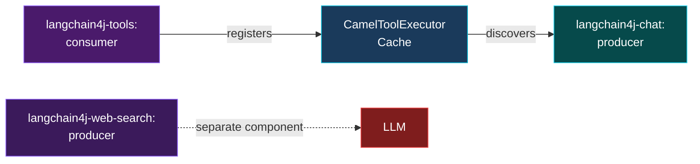
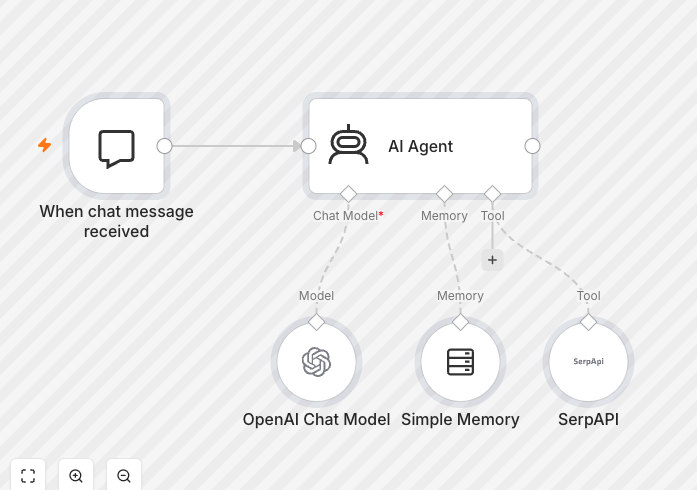
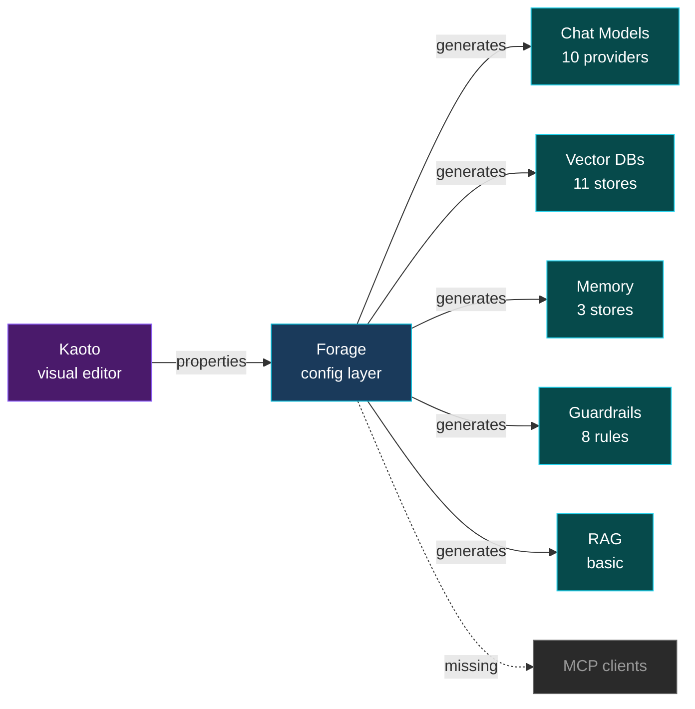
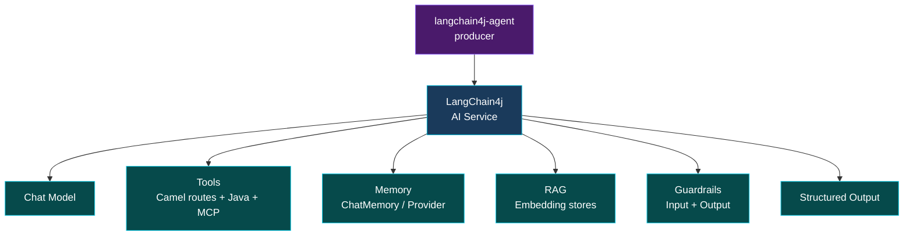
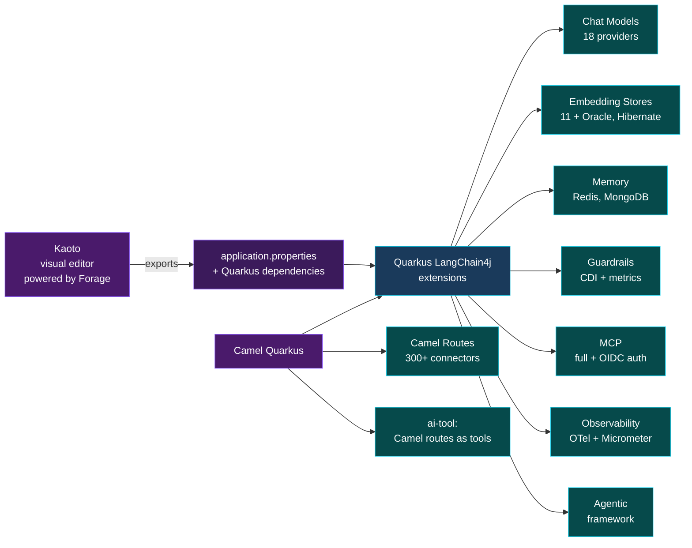
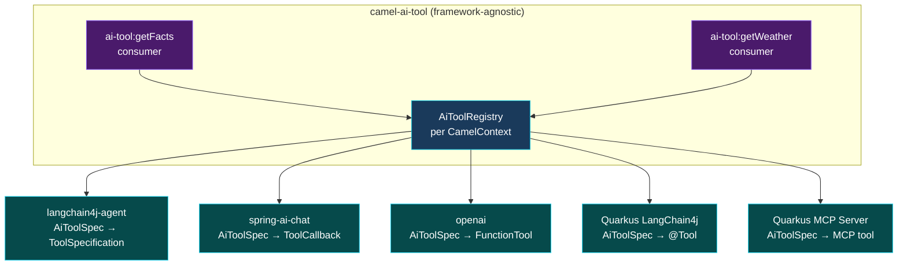

# Camel + LangChain4j

<div class="pt-6">
  <span class="text-2xl text-gray-300">Where we are, where we're going</span>
</div>

<div class="pt-8">
  <span class="px-4 py-2 rounded-lg bg-gradient-to-r from-orange-500/30 to-red-500/30 border border-orange-400/50 text-lg">
    Evolution, lessons learned & the Quarkus question
  </span>
</div>

<div class="abs-br m-6 flex gap-2">
  <span class="text-sm opacity-50">Zineb Bendhiba — July 2026</span>
</div>

---
layout: center
class: text-center
---

# The story so far

<div class="grid grid-cols-5 gap-2 mt-6 text-center" style="font-size: 0.75em;">

<div class="p-3 rounded-xl bg-purple-500/10 border border-purple-500/30">
  <div class="font-bold text-purple-400">4.5 / 4.6</div>
  <div class="text-xs opacity-40">Mar 2024</div>
  <div class="mt-1">Chat + Embeddings + Vector DBs</div>
  <div class="text-xs opacity-60">Qdrant, Milvus, Pinecone</div>
</div>

<div class="p-3 rounded-xl bg-purple-500/10 border border-purple-500/30">
  <div class="font-bold text-purple-400">4.7 / 4.8</div>
  <div class="text-xs opacity-40">Jul–Sep 2024</div>
  <div class="mt-1">Tools + Web Search + Tokenizer</div>
  <div class="text-xs opacity-60">Tools split from chat</div>
</div>

<div class="p-3 rounded-xl bg-cyan-500/10 border border-cyan-500/30">
  <div class="font-bold text-cyan-400">4.9</div>
  <div class="text-xs opacity-40">Dec 2024</div>
  <div class="mt-1">RAG in Chat</div>
  <div class="text-xs opacity-60">Aggregation strategy</div>
</div>

<div class="p-3 rounded-xl bg-cyan-500/10 border border-cyan-500/30">
  <div class="font-bold text-cyan-400">4.10</div>
  <div class="text-xs opacity-40">Feb 2025</div>
  <div class="mt-1">Vector DB integration</div>
  <div class="text-xs opacity-60">Neo4j, Qdrant, Milvus...</div>
</div>

<div class="p-3 rounded-xl bg-amber-500/10 border border-amber-500/30">
  <div class="font-bold text-amber-400">4.14</div>
  <div class="text-xs opacity-40">Aug 2025</div>
  <div class="mt-1">Agent + Forage</div>
  <div class="text-xs opacity-60">AI Service wrapper</div>
</div>

</div>

<div class="grid grid-cols-4 gap-2 mt-2 text-center mx-auto max-w-4xl" style="font-size: 0.75em;">

<div class="p-3 rounded-xl bg-amber-500/10 border border-amber-500/30">
  <div class="font-bold text-amber-400">4.15</div>
  <div class="text-xs opacity-40">Oct 2025</div>
  <div class="mt-1">Embedding Store</div>
  <div class="text-xs opacity-60">Dedicated component</div>
</div>

<div class="p-3 rounded-xl bg-green-500/10 border border-green-500/30">
  <div class="font-bold text-green-400">4.22</div>
  <div class="text-xs opacity-40">Jul 2026</div>
  <div class="mt-1">Unified AI Tool</div>
  <div class="text-xs opacity-60">Framework-agnostic tools</div>
</div>

<div class="p-3 rounded-xl bg-red-500/10 border border-red-500/30">
  <div class="font-bold text-red-400">Next</div>
  <div class="text-xs opacity-40">&nbsp;</div>
  <div class="mt-1">Quarkus-native?</div>
  <div class="text-xs opacity-60">The question we're here to discuss</div>
</div>

</div>

<!--
- Quick timeline to frame the discussion
- Each phase solved a real problem but also created new ones
- We're at a crossroads now
- Embedding Store (4.15): created by Thomas Cunningham. A standalone component wrapping LangChain4j's EmbeddingStore API with ADD, REMOVE, and SEARCH operations. Not wired into the vector DB components (Qdrant, Milvus, etc.) — those don't depend on it. Not used by the agent either. It provides its own path to store/search embeddings via LangChain4j, separate from the existing vector DB components.
-->

---
layout: default
---

# Phase 1: Chat + Embeddings + Vector DBs <span class="text-sm opacity-40">— 4.5 / 4.6 (Mar 2024)</span>

<div class="grid grid-cols-2 gap-8 mt-6">

<div>

### What we built

- `camel-langchain4j-chat` — talk to any LLM
- `camel-langchain4j-embeddings` — generate vectors
- Embedding datatypes for **Qdrant**, **Milvus**, **Pinecone**

<div class="mt-4 p-4 rounded-xl bg-green-500/10 border border-green-500/30">

**Key decision**: no per-provider components

One component for all LLM providers. User swaps the model bean.

</div>

</div>

<div>

### The trade-off

```yaml
# User provides the model bean
- route:
    from:
      uri: direct:chat
      steps:
        - to:
            uri: langchain4j-chat:assistant
            parameters:
              chatModel: "#myOpenAiModel"
```

<div class="mt-4 text-sm text-amber-400">
This kept things simple... but made visual tooling hard later.
</div>

</div>

</div>

<!--
- Originally "camel-langchain", renamed to "camel-langchain4j" in 4.6 (CAMEL-20611)
- Embeddings + vector DB datatypes (Qdrant, Milvus) shipped alongside chat in 4.5
- No camel-langchain4j-openai, no camel-langchain4j-ollama
- LangChain4j already abstracts providers — why duplicate?
- But: Kaoto needs component-level knobs, not bean references
-->

---
layout: default
---

# Phase 2: Tools + Web Search + Tokenizer <span class="text-sm opacity-40">— 4.7 / 4.8 (Jul–Sep 2024)</span>

<div class="mt-6">



</div>

<div class="grid grid-cols-3 gap-4 mt-6">

<div class="p-4 rounded-xl bg-purple-500/10 border border-purple-500/30">

**`camel-langchain4j-tools`**

Tools started inside chat (4.7), then split into their own component (4.8). Consumer routes discovered via shared cache.

</div>

<div class="p-4 rounded-xl bg-cyan-500/10 border border-cyan-500/30">

**`camel-langchain4j-web-search`**

LLM-driven web search (Google, Tavily). Clean, standalone producer.

</div>

<div class="p-4 rounded-xl bg-green-500/10 border border-green-500/30">

**`camel-langchain4j-tokenizer`**

Model-specific text splitters (word, sentence, paragraph). Each LLM tokenizes differently.

</div>

</div>

<!--
- 4.7 (CAMEL-20822): tools implemented inside chat component
- 4.8 (CAMEL-21153): tools split into separate camel-langchain4j-tools component
- 4.8 (CAMEL-20935): web search added
- 4.8 (CAMEL-20986): tokenizer/chunking support added
- Tools as a separate component: clean separation but created the cache pattern
- Cache pattern would later be duplicated across frameworks (Spring AI, Agent)
-->

---
layout: default
---

# Phase 3: Vector DB expansion & the search problem <span class="text-sm opacity-40">— 4.9 / 4.10 (Dec 2024–Feb 2025)</span>

<div class="mt-4">


</div>

<div class="grid grid-cols-2 gap-6 mt-6">

<div class="p-4 rounded-xl bg-amber-500/10 border border-amber-500/30">

### Why duplicate LangChain4j internals?

LangChain4j uses its own storage format (properties, collection names). To reuse RAG data across Camel and LangChain4j, we **must** write embeddings the LangChain4j way.

Different storage = broken RAG retrieval.

</div>

<div class="p-4 rounded-xl bg-red-500/10 border border-red-500/30">

### Vector search: the hard part

The reverse (similarity search) was much harder.

**Neo4j**: the vector search code was incomprehensible, undocumented, the Java API wasn't ready. Felt like copy-pasting opaque code we couldn't maintain or demo.

We decided **not to ship** what we couldn't maintain.

</div>

</div>

<!--
- 4.9 (CAMEL-20968): RAG option added to chat via aggregation strategy
- 4.10 (CAMEL-21541): Neo4j vector DB investigation — painful experience
- Qdrant, Milvus, Pinecone datatypes existed since 4.5, but deeper vector DB work came later
- Embedding stores: deliberate code duplication for RAG compatibility
- Vector search: started (camel-langchain4j-vector-search) but remains incomplete
- Right call: shipping unmaintainable code is worse than shipping nothing
-->

---
layout: center
class: text-center
---

# The RAG gap <span class="text-sm opacity-40">— 4.9 (Dec 2024)</span>

<div class="text-xl mt-6 text-gray-400 max-w-2xl mx-auto">
  We had all the building blocks, but no way to do RAG end-to-end from a single component.
</div>

<div class="mt-8 grid grid-cols-4 gap-4 max-w-3xl mx-auto">

<div class="p-4 rounded-xl bg-green-500/10 border border-green-500/30">
  <div class="text-2xl mb-2">✅</div>
  <div class="text-sm">Split text</div>
</div>

<div class="p-4 rounded-xl bg-green-500/10 border border-green-500/30">
  <div class="text-2xl mb-2">✅</div>
  <div class="text-sm">Generate embeddings</div>
</div>

<div class="p-4 rounded-xl bg-green-500/10 border border-green-500/30">
  <div class="text-2xl mb-2">✅</div>
  <div class="text-sm">Store vectors</div>
</div>

<div class="p-4 rounded-xl bg-red-500/10 border border-red-500/30">
  <div class="text-2xl mb-2">❌</div>
  <div class="text-sm">Retrieve + inject into prompt</div>
</div>

</div>

<v-click>

<div class="mt-8 p-4 rounded-xl bg-cyan-500/10 border border-cyan-500/30 max-w-2xl mx-auto">

Meanwhile, LangChain4j had <strong>AI Services</strong> — one interface that combines
chat + tools + memory + RAG. One call does everything.

</div>

</v-click>

<!--
- We added RAG aggregation strategy in chat — but it's manual wiring
- LangChain4j AI Service: the integrated experience we couldn't match
-->

---
layout: center
class: text-center
---

# The n8n gap

<div class="text-xl mt-4 text-gray-400 max-w-2xl mx-auto">
  Meanwhile, tools like n8n let you visually build an AI agent with everything it needs.
</div>

<div class="mt-6">
  
</div>

<div class="mt-6 p-4 rounded-xl bg-amber-500/10 border border-amber-500/30 max-w-2xl mx-auto text-sm">

Drag an agent, drag an LLM, drag a vector DB, drag tools, drag memory — done.
We had none of this visual experience in Kaoto.

</div>

<!--
- n8n: no-code AI agent builder — everything visual, everything connected
- This is what users expect from a modern integration platform
- We wanted to bring this experience to Kaoto
- But our component model (no per-provider components) made it very hard
-->

---
layout: default
---

# Kaoto + Forage <span class="text-sm opacity-40">— Aug 2025</span>

<div class="mt-4 text-lg text-gray-400">
  Goal: replicate the n8n experience — visually build an AI agent
</div>

<div class="mt-6">



</div>

<div class="mt-6 p-4 rounded-xl bg-green-500/10 border border-green-500/30">

Forage has grown significantly: **10 LLM providers**, **11 vector DBs**, **3 memory stores**, **8 guardrails**, basic RAG, multi-agent routing, and Quarkus + Spring Boot starters. Currently in production-hardening phase.

</div>

<!--
- Forage has expanded way beyond the initial LLM-only scope
- Chat models: OpenAI, Anthropic, Ollama, Gemini, Mistral, Azure, Bedrock, WatsonX, HuggingFace, LocalAI, DashScope
- Vector DBs: Qdrant, Milvus, Neo4j, PgVector, Pinecone, Weaviate, Chroma, Redis, MariaDB, Infinispan, in-memory
- Memory: Infinispan, Redis, message-window
- Guardrails: 5 input (code injection, input length, keyword filter, PII, prompt injection) + 3 output (JSON format, output length, sensitive data)
- Still missing: MCP clients, embedding model diversity (only Ollama), advanced RAG strategies
- Multi-agent: header/property/routeId/variable-based agent selection
- Recent work: hardening (guardrail opt-in, memory loss fixes, config validation)
-->

---
layout: default
---

# LangChain4j Agent — wrapping AIService <span class="text-sm opacity-40">— 4.14 (Aug 2025)</span>

<div class="mt-4 text-lg text-gray-400">
  One component to rule them all
</div>

<div class="mt-6">



</div>

<div class="grid grid-cols-2 gap-6 mt-4">

<div class="p-3 rounded-xl bg-green-500/10 border border-green-500/30 text-sm">

**What it solves**: end-to-end AI interaction. Chat + tools + memory + RAG + guardrails in one route step.

</div>

<div class="p-3 rounded-xl bg-red-500/10 border border-red-500/30 text-sm">

**What it doesn't solve**: configuring all of this from properties. Users need to know LangChain4j to create the beans.

</div>

</div>

<!--
- Name "agent" was fun competitive positioning against n8n
- But now LangChain4j has its own "Agent" concept (agentic workflows)
- May need to rename to camel-langchain4j-aiservice
-->

---
layout: default
---

# The configuration cliff

<div class="mt-4 text-lg text-gray-400">
  The agent component is powerful — but can users configure it?
</div>

<div class="mt-6">

| Concern | Camel core | With Forage | Quarkus LangChain4j |
|---|---|---|---|
| Chat models | ❌ Java bean | ✅ 10 providers | ✅ 18 providers |
| Embedding models | ❌ Java bean | ⚠️ Ollama only | ✅ 10 providers |
| Vector stores | ❌ Java bean | ✅ 11 stores | ✅ 11 + Oracle, Hibernate |
| Memory | ❌ Java bean | ✅ 3 stores | ✅ 2 stores |
| RAG | ❌ Java bean | ⚠️ Basic | ✅ Easy RAG + loaders |
| Guardrails | ❌ Java bean | ✅ 8 rules | ✅ CDI + metrics |
| MCP | ❌ Java bean | ❌ | ✅ Full + OIDC auth |
| Tools | ✅ `camel-ai-tool` | ✅ | ✅ @Tool + MCP |
| Security | ❌ | ❌ | ✅ OIDC + auth |
| Observability | ❌ | ❌ | ✅ OTel + Micrometer |
| Dev services | ❌ | ❌ | ✅ Testcontainers |
| Agentic | ❌ | ❌ | ✅ Agentic framework |

</div>

<!--
- Three columns tell the story: Camel core can't do it, Forage covers the basics, Quarkus LangChain4j covers everything
- Forage is a separate project, not part of Camel — extra dependency for users
- Quarkus LangChain4j has 4 areas neither Camel nor Forage touch: MCP, security, observability, agentic
- Embedding model gap in Forage is significant: only Ollama vs 10 providers in Quarkus
- Forage leads on memory (3 vs 2 stores) but that's a small win
-->

---
layout: default
---

# The Forage risk

<div class="mt-6 grid grid-cols-2 gap-6">

<div class="p-4 rounded-xl bg-red-500/10 border border-red-500/30">
  <div class="font-bold text-red-400">Small community</div>
  <div class="text-sm mt-2 opacity-80">
    Forage is a young project with a small contributor base. We're building a critical dependency on something that doesn't have the community maturity of Quarkus LangChain4j.
  </div>
</div>

<div class="p-4 rounded-xl bg-red-500/10 border border-red-500/30">
  <div class="font-bold text-red-400">Configures code that doesn't exist in Camel</div>
  <div class="text-sm mt-2 opacity-80">
    Forage generates beans for 11 embedding stores, memory stores, guardrails — but none of this code lives in Camel or Camel Quarkus. It's LangChain4j code configured from outside.
  </div>
</div>

<div class="p-4 rounded-xl bg-red-500/10 border border-red-500/30">
  <div class="font-bold text-red-400">Zero native compilation proof</div>
  <div class="text-sm mt-2 opacity-80">
    There is no evidence that those embedding stores, memory stores, or guardrails will compile and work in GraalVM native mode. Quarkus LangChain4j extensions are designed and tested for JVM + native from day one.
  </div>
</div>

<div class="p-4 rounded-xl bg-red-500/10 border border-red-500/30">
  <div class="font-bold text-red-400">Growing scope, growing risk</div>
  <div class="text-sm mt-2 opacity-80">
    Forage was meant for UI configuration. It has grown into a huge project covering 11 vector DBs, 10 LLM providers, guardrails, memory, RAG. Relying on something this new at this scale is risky — better to use Quarkus bits that are already proven.
  </div>
</div>

</div>

<!--
- Forage started as a UI config bridge for Kaoto
- It's now a parallel infrastructure to Quarkus LangChain4j — but without the maturity
- The embedding stores in Forage: does anyone test them in native? Who maintains them?
- Quarkus LangChain4j has runtime/deployment split = native compilation is baked in from the start
- Every Quarkus extension goes through native testing in CI
- Forage is an external project that we can't fully control or guarantee
-->

---
layout: default
---

# The alternative: Quarkus-native agent

<div class="text-sm text-gray-400 mt-1">If the agent is native to Quarkus LangChain4j, Kaoto exports config — not code.</div>

<div class="mt-2">



</div>

<div class="grid grid-cols-3 gap-3 mt-2" style="font-size: 0.75em;">

<div class="p-2 rounded-xl bg-green-500/10 border border-green-500/30">
  <div class="font-bold text-green-400">No code to maintain</div>
  <div class="text-xs mt-1 opacity-80">Properties + deps, not generated beans</div>
</div>

<div class="p-2 rounded-xl bg-green-500/10 border border-green-500/30">
  <div class="font-bold text-green-400">Native from day one</div>
  <div class="text-xs mt-1 opacity-80">QL4J extensions have native CI built-in</div>
</div>

<div class="p-2 rounded-xl bg-green-500/10 border border-green-500/30">
  <div class="font-bold text-green-400">Camel does what Camel does best</div>
  <div class="text-xs mt-1 opacity-80">Connectors + routing. Quarkus handles AI infra.</div>
</div>

</div>

<!--
- Key shift: Kaoto exports application.properties + maven dependencies, not Java code
- No Forage layer generating beans — Quarkus LangChain4j handles the bean lifecycle natively
- No CQ extensions to create/maintain for embedding stores, memory, guardrails
- Camel Quarkus already integrates with Quarkus — this is just adding QL4J extensions to the mix
- Camel's unique value: the 300+ connectors and ai-tool: for exposing routes as LLM tools
- Everything else (models, memory, RAG, MCP, security, observability) is Quarkus LangChain4j's job
-->

---
layout: default
---

# Unified AI Tool (CAMEL-23382) <span class="text-sm opacity-40">— 4.22 (Jul 2026)</span>

<div class="mt-4">



</div>

<div class="grid grid-cols-3 gap-4 mt-4">

<div class="p-3 rounded-xl bg-green-500/10 border border-green-500/30 text-sm">
  <div class="font-bold text-green-400">Define once</div>
  <div class="mt-1 opacity-80">One consumer endpoint, any AI framework</div>
</div>

<div class="p-3 rounded-xl bg-green-500/10 border border-green-500/30 text-sm">
  <div class="font-bold text-green-400">Quarkus LangChain4j tools</div>
  <div class="mt-1 opacity-80">Camel routes exposed as QL4J @Tool beans</div>
</div>

<div class="p-3 rounded-xl bg-green-500/10 border border-green-500/30 text-sm">
  <div class="font-bold text-green-400">MCP Server tools</div>
  <div class="mt-1 opacity-80">Camel routes exposed as Quarkus MCP server tools</div>
</div>

</div>

<!--
- Step 1: camel-ai-tool module (done)
- Step 2: wire langchain4j-agent producer (in progress)
- Steps 3-6: spring-ai, langchain4j-tools producer, deprecations, openai
- Key new angle: ai-tool opens the door to exposing Camel routes as QL4J tools and Quarkus MCP server tools
- This means any Camel route can become a tool in QL4J's @RegisterAiService or an MCP tool served by Quarkus MCP Server
-->

---
layout: center
class: text-center
---

# Thank you

<div class="mt-8 text-xl text-gray-400">
  Let's discuss.
</div>

<div class="mt-12 text-sm opacity-40">
  Zineb Bendhiba — July 2026
</div>
