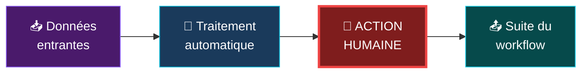
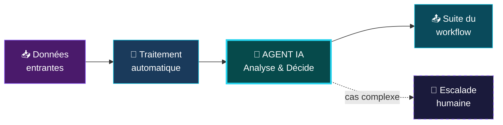
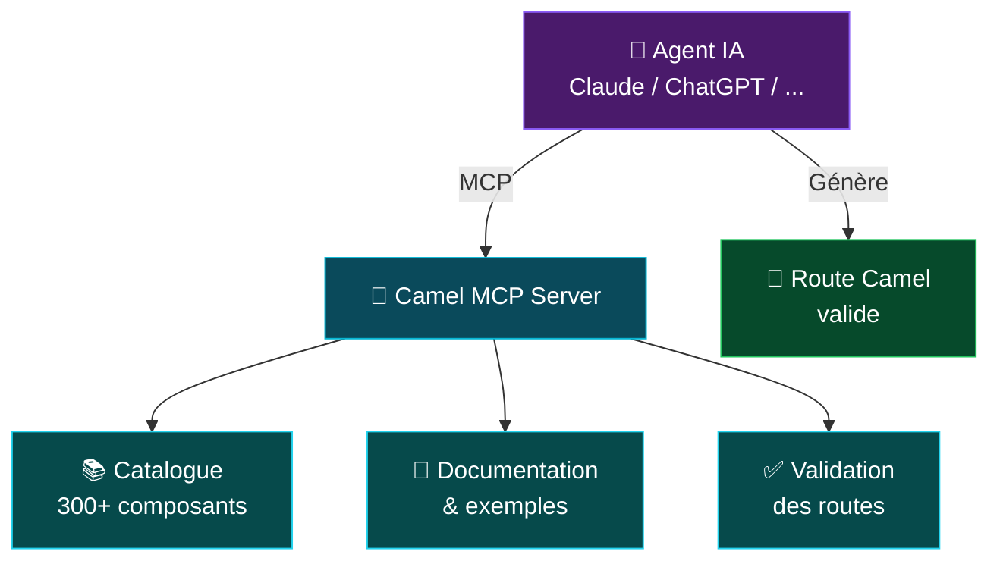
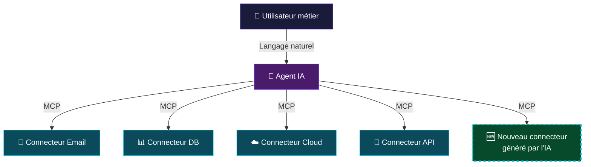
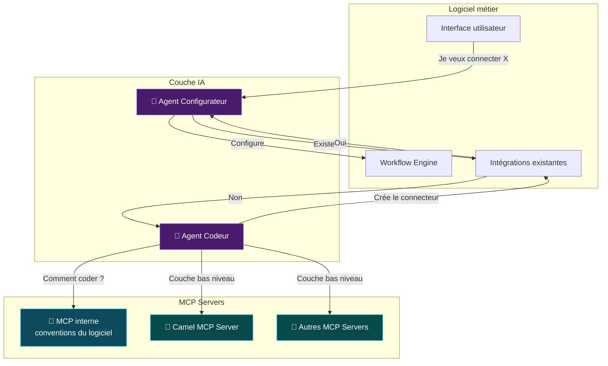

# L'intégration intelligente

<div class="pt-6">
  <span class="text-2xl text-gray-300">Quand vos flux de données deviennent autonomes</span>
</div>

<div class="pt-8">
  <span class="px-4 py-2 rounded-lg bg-gradient-to-r from-purple-500/30 to-cyan-500/30 border border-purple-400/50 text-lg">
    De l'intégration classique à l'intégration agentique
  </span>
</div>

<div class="abs-br m-6 flex gap-2">
  <span class="text-sm opacity-50">Zineb Bendhiba — 2026</span>
</div>

<!--
- Intégration intelligente = flux de données autonomes grâce à l'IA agentique
- De l'intégration classique vers l'intégration agentique
-->

---
transition: fade-out
layout: two-cols
class: text-left
---

# Zineb Bendhiba

<div class="mt-6 space-y-3 opacity-80">

- Principal Software Engineer @ IBM / Red Hat
- Apache Camel PMC member
- Camel Quarkus maintainer
- Contributor : Quarkus, Kaoto, Wanaku, Camel AI
- Duchess France alumna

</div>

<div class="my-8 grid grid-cols-[40px_1fr] gap-y-4">
  <ri-github-line class="opacity-50"/>
  <div><a href="https://github.com/zbendhiba" target="_blank">zbendhiba</a></div>
  <ri-twitter-x-line class="opacity-50"/>
  <div><a href="https://x.com/ZinebBendhiba" target="_blank">@ZinebBendhiba</a></div>
  <ri-bluesky-line class="opacity-50"/>
  <div><a href="https://bsky.app/profile/zinebbendhiba.com" target="_blank">@zinebbendhiba.com</a></div>
  <ri-global-line class="opacity-50"/>
  <div><a href="https://zinebbendhiba.com" target="_blank">zinebbendhiba.com</a></div>
</div>

::right::

<div class="flex items-center justify-center h-full">
  
</div>

<!--
- Principal SE @ IBM / Red Hat
- PMC Apache Camel, maintainer Camel Quarkus
- Contrib : Quarkus, Kaoto, Wanaku, Camel AI
- Alumna Duchess France — contente d'être ici ce soir
-->

---
layout: center
class: text-center
---

# L'intégration, ça marche.

<div class="text-xl mt-6 text-gray-400 max-w-2xl mx-auto">
  Depuis 20 ans, on connecte des systèmes avec des patterns éprouvés.
</div>

<div class="mt-10 grid grid-cols-4 gap-6 max-w-3xl mx-auto">
  <div class="p-4 rounded-xl bg-purple-500/10 border border-purple-500/30">
    <div class="text-3xl mb-2">📨</div>
    <div class="text-sm">Messaging</div>
  </div>
  <div class="p-4 rounded-xl bg-cyan-500/10 border border-cyan-500/30">
    <div class="text-3xl mb-2">🔄</div>
    <div class="text-sm">Transformation</div>
  </div>
  <div class="p-4 rounded-xl bg-purple-500/10 border border-purple-500/30">
    <div class="text-3xl mb-2">🛣️</div>
    <div class="text-sm">Routing</div>
  </div>
  <div class="p-4 rounded-xl bg-cyan-500/10 border border-cyan-500/30">
    <div class="text-3xl mb-2">🔗</div>
    <div class="text-sm">Connecteurs</div>
  </div>
</div>

<div class="mt-8 text-sm text-gray-500">
  Enterprise Integration Patterns — Apache Camel — ...
</div>

<!--
- L'intégration ça marche, pas un problème à résoudre
- Patterns éprouvés depuis 20 ans (EIP)
- Messaging, transformation, routing, connecteurs
- Frameworks comme Apache Camel implémentent tout ça
-->

---
layout: default
---

# Un workflow d'intégration classique

<div class="mt-6">


</div>

<div class="mt-8 text-center text-lg text-gray-400">
  Tout est automatisé, prévisible, fiable.
</div>

<v-click>

<div class="mt-4 text-center text-xl text-amber-400">
  Jusqu'au moment où un humain doit intervenir...
</div>

</v-click>

<!--
- Réception → Transformation → Validation → Routage → Livraison → Notification
- Tout automatisé, prévisible, fiable
- [click] Jusqu'à l'intervention humaine...
-->

---
layout: center
---

# Le goulot d'étranglement humain

<div class="mt-6">



</div>

<div class="grid grid-cols-2 gap-6 mt-8 max-w-3xl mx-auto">

<div class="p-5 rounded-xl bg-red-500/10 border border-red-500/30">
  <div class="font-bold text-red-400 mb-2">Le workflow est bloqué</div>
  <div class="text-sm text-gray-400">En attente qu'un humain analyse, valide, décide. Minutes, heures, parfois jours.</div>
</div>

<div class="p-5 rounded-xl bg-red-500/10 border border-red-500/30">
  <div class="font-bold text-red-400 mb-2">L'humain fait un travail répétitif</div>
  <div class="text-sm text-gray-400">Analyser des logs, lire des PDF, classifier du contenu... tâches que l'IA sait déjà faire.</div>
</div>

</div>

<!--
- Bloc rouge = action humaine qui bloque le flux
- Attente : minutes, heures, parfois jours
- Souvent un travail répétitif que l'IA sait déjà faire
-->

---
layout: center
class: text-center
---

# Quelles tâches humaines bloquent vos workflows ?

<div class="grid grid-cols-3 gap-5 mt-8 max-w-3xl mx-auto text-left">

<v-clicks>

<div class="p-5 rounded-xl bg-purple-500/10 border border-purple-500/30">
  <div class="text-2xl mb-2">📋</div>
  <div class="font-bold text-purple-300">Validation de formulaires</div>
  <div class="text-sm text-gray-400 mt-2">Lire un PDF, vérifier les champs, croiser avec une base de données</div>
</div>

<div class="p-5 rounded-xl bg-cyan-500/10 border border-cyan-500/30">
  <div class="text-2xl mb-2">🔍</div>
  <div class="font-bold text-cyan-300">Analyse de logs</div>
  <div class="text-sm text-gray-400 mt-2">Détecter une anomalie, classifier l'erreur, décider de l'action</div>
</div>

<div class="p-5 rounded-xl bg-emerald-500/10 border border-emerald-500/30">
  <div class="text-2xl mb-2">📄</div>
  <div class="font-bold text-emerald-300">Classification de contenu</div>
  <div class="text-sm text-gray-400 mt-2">Trier des emails, catégoriser des tickets, router selon le sujet</div>
</div>

<div class="p-5 rounded-xl bg-amber-500/10 border border-amber-500/30">
  <div class="text-2xl mb-2">✅</div>
  <div class="font-bold text-amber-300">Approbation de données</div>
  <div class="text-sm text-gray-400 mt-2">Vérifier la cohérence, valider la conformité, donner le feu vert</div>
</div>

<div class="p-5 rounded-xl bg-rose-500/10 border border-rose-500/30">
  <div class="text-2xl mb-2">🧾</div>
  <div class="font-bold text-rose-300">Extraction d'information</div>
  <div class="text-sm text-gray-400 mt-2">Lire des factures, extraire des montants, structurer des données libres</div>
</div>

<div class="p-5 rounded-xl bg-indigo-500/10 border border-indigo-500/30">
  <div class="text-2xl mb-2">💬</div>
  <div class="font-bold text-indigo-300">Analyse de sentiment</div>
  <div class="text-sm text-gray-400 mt-2">Évaluer le ton d'un message client, prioriser les urgences</div>
</div>

</v-clicks>

</div>

<!--
- [clicks] 6 exemples de tâches humaines bloquantes
- Validation PDF, analyse logs, classification, approbation, extraction, sentiment
- Toutes cognitives mais répétitives = sweet spot de l'IA
-->

---
layout: center
---

# Use case 1 : Débloquer les workflows avec l'IA

<div class="text-lg text-gray-400 text-center mb-6">
  Remplacer le goulot humain par un agent IA dans le flux
</div>

<div class="mt-4">



</div>

<div class="grid grid-cols-3 gap-4 mt-8 max-w-3xl mx-auto text-center text-sm">
  <div class="p-3 rounded-lg bg-emerald-500/10 border border-emerald-500/30 text-emerald-300">
    Temps de traitement : minutes → secondes
  </div>
  <div class="p-3 rounded-lg bg-emerald-500/10 border border-emerald-500/30 text-emerald-300">
    Disponible 24/7
  </div>
  <div class="p-3 rounded-lg bg-emerald-500/10 border border-emerald-500/30 text-emerald-300">
    Escalade humaine quand nécessaire
  </div>
</div>

<!--
- Remplacer le goulot humain par un agent IA dans le flux
- Minutes → secondes, disponible 24/7
- Cas complexe → escalade humaine
- L'IA gère le courant, l'humain gère l'exception
-->

---
layout: two-cols
layoutClass: gap-8
---

# Exemple concret

**Validation de factures PDF**

<div class="mt-4 text-sm space-y-3">

<v-clicks>

<div class="p-3 rounded-lg bg-red-500/10 border border-red-500/20">
  <span class="text-red-400 font-bold">Avant :</span> Un employé ouvre chaque PDF, vérifie les montants, compare avec le bon de commande, approuve ou rejette. <span class="text-red-400">~15 min/facture</span>
</div>

<div class="p-3 rounded-lg bg-emerald-500/10 border border-emerald-500/20">
  <span class="text-emerald-400 font-bold">Après :</span> Un agent IA dans le workflow lit le PDF, extrait les données, croise avec la base, et décide. L'humain n'intervient que sur les cas litigieux. <span class="text-emerald-400">~5 sec/facture</span>
</div>

</v-clicks>

</div>

<v-click>

<div class="mt-6 p-3 rounded-lg bg-purple-500/10 border border-purple-500/30 text-sm">
  L'IA ne remplace pas l'humain. <br>Elle <span class="text-purple-300 font-bold">libère l'humain</span> pour les décisions qui comptent vraiment.
</div>

</v-click>

::right::

<div class="mt-12">

```yaml
# Route Camel + OpenAI structured output
- route:
    from:
      uri: file:invoices/incoming
      steps:
        - setBody:
            simple: "Analyse cette facture.
              Vérifie montant, TVA,
              correspondance bon de commande."
        - to:
            uri: openai:chat-completion
            parameters:
              jsonSchema: >
                resource:classpath:
                invoice-decision.schema.json
        - setVariable:
            name: decision
            jsonpath:
              expression: $.approved
        - choice:
            when:
              - simple: "${variable.decision}"
                steps:
                  - to: sql:insert-approved
            otherwise:
              steps:
                - to: slack:finance-review
```

</div>

<!--
- [click] Avant : 15 min/facture, humain ouvre chaque PDF
- [click] Après : 5 sec/facture, agent IA dans route Camel
- [click] L'IA libère l'humain pour les vraies décisions
- À droite : exemple Camel YAML avec LangChain4j
-->

---
layout: center
class: text-center
---

# L'IA peut raisonner dans vos workflows.

<div class="mt-6 text-xl text-gray-400 max-w-2xl mx-auto">
  Mais peut-elle aussi les <span class="text-purple-400 font-bold">créer</span> ?
</div>

<!--
- Transition : on a vu raisonner → maintenant créer
-->

---
layout: center
---

# Créer : l'IA comme développeur d'intégrations

<div class="text-lg text-gray-400 text-center mb-8">
  Et si un agent IA pouvait concevoir vos workflows d'intégration ?
</div>

<div class="grid grid-cols-3 gap-6 max-w-3xl mx-auto text-center">

<v-clicks>

<div class="p-5 rounded-2xl bg-purple-500/10 border border-purple-500/30">
  <div class="text-3xl mb-3">💬</div>
  <div class="font-bold text-purple-300 mb-2">Décrire</div>
  <div class="text-sm text-gray-400">L'utilisateur exprime son besoin en langage naturel</div>
</div>

<div class="p-5 rounded-2xl bg-cyan-500/10 border border-cyan-500/30">
  <div class="text-3xl mb-3">🔍</div>
  <div class="font-bold text-cyan-300 mb-2">Chercher</div>
  <div class="text-sm text-gray-400">L'agent explore le catalogue de composants et trouve la bonne combinaison</div>
</div>

<div class="p-5 rounded-2xl bg-emerald-500/10 border border-emerald-500/30">
  <div class="text-3xl mb-3">⚡</div>
  <div class="font-bold text-emerald-300 mb-2">Générer</div>
  <div class="text-sm text-gray-400">L'agent produit le workflow d'intégration, prêt à exécuter</div>
</div>

</v-clicks>

</div>

<!--
- 3 étapes : Décrire → Chercher → Générer
- L'utilisateur parle en langage naturel
- L'agent explore le catalogue, trouve la bonne combinaison
- Produit un workflow prêt à exécuter
-->

---
layout: two-cols
layoutClass: gap-8
---

# Exemple : le Camel MCP Server

<div class="mt-4 space-y-2 text-sm">

<v-clicks>

<div class="p-2 rounded-lg bg-purple-500/10 border border-purple-500/20">
  L'agent interroge le catalogue : <span class="text-purple-300">"Quels composants pour lire des emails ?"</span>
</div>

<div class="p-2 rounded-lg bg-cyan-500/10 border border-cyan-500/20">
  Retourne les composants, options et exemples
</div>

<div class="p-2 rounded-lg bg-emerald-500/10 border border-emerald-500/20">
  Génère une route Camel valide
</div>

<div class="p-2 rounded-lg bg-purple-500/10 border border-purple-500/20">
  <span class="text-purple-300">Valide les routes</span> générées avant exécution
</div>

<div class="p-2 rounded-lg bg-amber-500/10 border border-amber-500/20 text-xs">
  Compatible : Claude Code, OpenAI Codex, GitHub Copilot, JetBrains AI, ou tout client MCP
</div>

</v-clicks>

</div>

::right::

<div class="mt-12">



</div>

<!--
- MCP Server expose le catalogue Apache Camel (300+ composants)
- [click] Interroge le catalogue en langage naturel
- [click] Retourne composants, options, exemples
- [click] Génère une route YAML valide
- [click] Valide la route avant exécution — pas confiance aveugle
- [click] Compatible Claude Code, Codex, Copilot, JetBrains AI, tout client MCP
-->

---
layout: center
class: text-center
---

# On peut aller encore plus loin.

<div class="mt-6 text-xl text-gray-400 max-w-2xl mx-auto">
  L'IA crée des workflows pour les <span class="text-cyan-400">développeurs</span>.<br><br>
  Et si elle pouvait aussi rendre les <span class="text-purple-400 font-bold">logiciels métier</span> extensibles par leurs utilisateurs ?
</div>

<!--
- Transition : créer pour les devs → étendre pour les utilisateurs métier
-->

---
layout: default
---

# Les logiciels métier cachent de l'intégration

<div class="mt-6 grid grid-cols-2 gap-8">

<div>
  <div class="text-lg text-purple-300 mb-4">Ce que l'utilisateur voit :</div>
  <div class="p-6 rounded-xl bg-purple-500/10 border border-purple-500/30">
    <div class="space-y-3 text-sm">
      <div class="p-2 rounded bg-purple-500/10">📝 Formulaire de demande</div>
      <div class="text-center text-purple-400">↓</div>
      <div class="p-2 rounded bg-purple-500/10">✅ Approbation manager</div>
      <div class="text-center text-purple-400">↓</div>
      <div class="p-2 rounded bg-purple-500/10">📧 Notification email</div>
      <div class="text-center text-purple-400">↓</div>
      <div class="p-2 rounded bg-purple-500/10">📊 Mise à jour du dashboard</div>
    </div>
  </div>
</div>

<div>
  <div class="text-lg text-cyan-300 mb-4">Ce qui tourne vraiment :</div>
  <div class="p-6 rounded-xl bg-cyan-500/10 border border-cyan-500/30">
    <div class="space-y-3 text-sm">
      <div class="p-2 rounded bg-cyan-500/10">📥 HTTP endpoint + validation</div>
      <div class="text-center text-cyan-400">↓</div>
      <div class="p-2 rounded bg-cyan-500/10">🔄 Workflow engine + routing</div>
      <div class="text-center text-cyan-400">↓</div>
      <div class="p-2 rounded bg-cyan-500/10">📨 SMTP connector</div>
      <div class="text-center text-cyan-400">↓</div>
      <div class="p-2 rounded bg-cyan-500/10">🔗 REST API call + DB write</div>
    </div>
  </div>
</div>

</div>

<v-click>

<div class="mt-6 text-center text-amber-400">
  Le problème ? Ces workflows sont figés. Ajouter une intégration = développement custom.
</div>

</v-click>

<!--
- Gauche : ce que l'utilisateur voit (formulaire, approbation, email, dashboard)
- Droite : ce qui tourne vraiment (HTTP, workflow engine, SMTP, REST/DB)
- [click] Workflows figés, nouvelle intégration = dev custom = semaines
-->

---
layout: center
---

# Use case 2 : Rendre les workflows configurables par l'IA

<div class="text-gray-400 text-center mb-8">
  Des agents IA qui configurent et étendent les workflows automatiquement
</div>

<div class="grid grid-cols-2 gap-8 max-w-3xl mx-auto">

<div class="p-6 rounded-2xl bg-gradient-to-b from-purple-500/20 to-transparent border border-purple-500/30">
  <div class="text-3xl mb-3">🛠️</div>
  <div class="text-lg font-bold text-purple-300 mb-3">Agent Configurateur</div>
  <div class="text-sm text-gray-400 space-y-2">
    <div>L'utilisateur décrit son besoin en langage naturel</div>
    <div class="text-purple-300">"Quand un client s'inscrit, envoie un email de bienvenue et crée un ticket Jira"</div>
    <div>L'agent génère et configure le workflow d'intégration</div>
  </div>
</div>

<div class="p-6 rounded-2xl bg-gradient-to-b from-cyan-500/20 to-transparent border border-cyan-500/30">
  <div class="text-3xl mb-3">🧠</div>
  <div class="text-lg font-bold text-cyan-300 mb-3">Agent Développeur</div>
  <div class="text-sm text-gray-400 space-y-2">
    <div>L'intégration demandée n'existe pas encore ?</div>
    <div class="text-cyan-300">L'agent développe le connecteur, le teste, et l'ajoute au logiciel</div>
    <div>Création autonome de nouvelles intégrations</div>
  </div>
</div>

</div>

<!--
- Agent Configurateur : utilisateur décrit en langage naturel → workflow configuré
- Agent Développeur : intégration n'existe pas → l'agent la crée
- Deux niveaux d'autonomie dans un même logiciel
-->

---
layout: two-cols
layoutClass: gap-8
---

# Du "dev only" au "user empowered"

<div class="mt-4">

### Le parcours classique

<div class="mt-4 space-y-2 text-sm">
  <div class="p-2 rounded bg-red-500/10 text-red-300">1. L'utilisateur demande une intégration Salesforce</div>
  <div class="p-2 rounded bg-red-500/10 text-red-300">2. Ticket créé → backlog dev</div>
  <div class="p-2 rounded bg-red-500/10 text-red-300">3. Un développeur code le connecteur</div>
  <div class="p-2 rounded bg-red-500/10 text-red-300">4. Tests, review, déploiement</div>
  <div class="p-2 rounded bg-red-500/10 text-red-300">5. 3 semaines plus tard... ✅</div>
</div>

</div>

::right::

<div class="mt-4">

### Le parcours avec IA + MCP

<div class="mt-4 space-y-2 text-sm">

<v-clicks>

  <div class="p-2 rounded bg-emerald-500/10 text-emerald-300">1. L'utilisateur décrit son besoin</div>
  <div class="p-2 rounded bg-emerald-500/10 text-emerald-300">2. L'agent IA identifie le connecteur nécessaire</div>
  <div class="p-2 rounded bg-emerald-500/10 text-emerald-300">3. Via MCP, il configure l'intégration</div>
  <div class="p-2 rounded bg-emerald-500/10 text-emerald-300">4. L'utilisateur valide et active</div>
  <div class="p-2 rounded bg-emerald-500/10 text-emerald-300">5. Quelques minutes plus tard... ✅</div>

</v-clicks>

</div>

</div>

<!--
- Gauche : classique = ticket, backlog, dev, 3 semaines
- [clicks] Droite : IA + MCP = décrit, identifie, configure, valide, quelques minutes
- Changement de paradigme
-->

---
layout: center
---

# MCP : Le pont entre les agents IA et vos systèmes

<div class="mt-6">



</div>

<div class="mt-6 text-center">
  <span class="px-4 py-2 rounded-lg bg-cyan-500/20 border border-cyan-500/40 text-cyan-300">
    MCP = Model Context Protocol — conçu pour les devs, utile pour tous
  </span>
</div>

<!--
- Utilisateur parle en langage naturel → agent IA → connecteurs via MCP
- Point clé : connecteur en pointillé = nouveau, généré par l'IA
- Le logiciel s'étend de lui-même
-->

---
layout: center
---

# L'intégration autonome en action



<!--
- Schéma complet : utilisateur → Agent Configurateur → existe ? → configure le workflow
- Si non → Agent Codeur → MCP interne (conventions) + MCP externes (Camel, autres) pour le bas niveau
- L'agent crée le connecteur manquant
-->

---
layout: center
class: text-center
---

# La vision : l'intégration à 3 niveaux d'autonomie

<div class="grid grid-cols-3 gap-6 mt-8 max-w-3xl mx-auto">

<div class="p-6 rounded-2xl bg-gradient-to-b from-purple-500/20 to-transparent border border-purple-500/30 text-center">
  <div class="text-4xl mb-4">🔧</div>
  <div class="text-lg font-bold text-purple-300">Niveau 1</div>
  <div class="text-sm font-bold text-purple-200 mt-1 mb-3">Assisté</div>
  <div class="text-sm text-gray-400">
    L'IA aide le développeur à créer des routes et configurer des connecteurs
  </div>
</div>

<div class="p-6 rounded-2xl bg-gradient-to-b from-cyan-500/20 to-transparent border border-cyan-500/30 text-center">
  <div class="text-4xl mb-4">🤖</div>
  <div class="text-lg font-bold text-cyan-300">Niveau 2</div>
  <div class="text-sm font-bold text-cyan-200 mt-1 mb-3">Délégué</div>
  <div class="text-sm text-gray-400">
    Les agents IA remplacent les tâches humaines dans les workflows existants
  </div>
</div>

<div class="p-6 rounded-2xl bg-gradient-to-b from-emerald-500/20 to-transparent border border-emerald-500/30 text-center">
  <div class="text-4xl mb-4">🧠</div>
  <div class="text-lg font-bold text-emerald-300">Niveau 3</div>
  <div class="text-sm font-bold text-emerald-200 mt-1 mb-3">Autonome</div>
  <div class="text-sm text-gray-400">
    L'IA crée et étend les intégrations de manière autonome via MCP
  </div>
</div>

</div>

<!--
- Niveau 1 Assisté : IA aide le dev (Camel MCP Server, dispo aujourd'hui)
- Niveau 2 Délégué : IA remplace tâches humaines dans workflows existants
- Niveau 3 Autonome : IA crée et étend les intégrations via MCP
- On passe du 1 au 2, le 3 c'est la direction
-->

---
layout: center
---

# Les défis à relever

<div class="grid grid-cols-2 gap-6 mt-8 max-w-3xl mx-auto">

<div class="p-5 rounded-xl bg-amber-500/10 border border-amber-500/30">
  <div class="font-bold text-amber-300 mb-2">🔒 Sécurité & Gouvernance</div>
  <div class="text-sm text-gray-400">Qui autorise l'agent à connecter un système ? Audit trail, permissions, isolation des données.</div>
</div>

<div class="p-5 rounded-xl bg-amber-500/10 border border-amber-500/30">
  <div class="font-bold text-amber-300 mb-2">🎯 Qualité du code généré</div>
  <div class="text-sm text-gray-400">Prompts imprécis, descriptions MCP incomplètes, APIs obsolètes. Validation, tests automatiques et dry-run sont indispensables.</div>
</div>

<div class="p-5 rounded-xl bg-amber-500/10 border border-amber-500/30">
  <div class="font-bold text-amber-300 mb-2">🤝 Human in the loop</div>
  <div class="text-sm text-gray-400">L'autonomie oui, mais avec supervision. L'humain valide les cas critiques et les nouveaux connecteurs.</div>
</div>

<div class="p-5 rounded-xl bg-amber-500/10 border border-amber-500/30">
  <div class="font-bold text-amber-300 mb-2">📏 Standardisation</div>
  <div class="text-sm text-gray-400">MCP est jeune. Les patterns d'intégration agentique restent à définir et à stabiliser.</div>
</div>

</div>

<!--
- Sécurité : qui autorise l'agent à connecter un système prod ?
- Qualité : prompts imprécis, descriptions MCP incomplètes, APIs obsolètes → validation + dry-run
- Human in the loop : autonomie avec supervision
- Standardisation : MCP encore jeune, patterns à définir
-->

---
layout: center
class: text-center
---

# Ce qui existe déjà aujourd'hui

<div class="mt-8 space-y-4 text-lg">

<v-clicks>

<div class="px-6 py-3 rounded-xl bg-purple-500/15 border border-purple-500/30 inline-block">
  Apache Camel + composants OpenAI / LangChain4j = IA dans vos workflows
</div>

<div class="px-6 py-3 rounded-xl bg-purple-500/15 border border-purple-500/30 inline-block">
  Apache Camel comme pont entre vos process existants et des agents externes
</div>

<div class="px-6 py-3 rounded-xl bg-cyan-500/15 border border-cyan-500/30 inline-block">
  Camel MCP Server = l'IA crée et valide vos routes d'intégration
</div>

<div class="px-6 py-3 rounded-xl bg-emerald-500/15 border border-emerald-500/30 inline-block">
  Kaoto Editor pour visualiser et éditer les routes générées
</div>

<div class="px-6 py-3 rounded-xl bg-amber-500/15 border border-amber-500/30 inline-block">
  Tout est open source — prêt à expérimenter
</div>

</v-clicks>

</div>

<!--
- [click] Camel + OpenAI / LangChain4j pour intégrer l'IA dans les workflows
- [click] Camel MCP Server pour que l'IA crée et valide les routes
- [click] Kaoto pour le visuel
- [click] Tout open source
-->

---
layout: center
class: text-center
---

# Merci !

<div class="mt-8 text-xl text-gray-400 max-w-xl mx-auto">
  L'intégration n'est pas morte.<br>
  Elle devient <span class="text-cyan-400 font-bold">intelligente</span> et <span class="text-purple-400 font-bold">autonome</span>.
</div>

<div class="mt-12 grid grid-cols-2 gap-4 max-w-md mx-auto text-left text-sm">
  <div class="text-gray-500">X</div>
  <div><a href="https://x.com/ZinebBendhiba">@ZinebBendhiba</a></div>
  <div class="text-gray-500">Bluesky</div>
  <div><a href="https://bsky.app/profile/zinebbendhiba.com">@zinebbendhiba.com</a></div>
  <div class="text-gray-500">Web</div>
  <div><a href="https://zinebbendhiba.com">zinebbendhiba.com</a></div>
</div>

<div class="mt-8">
  <span class="px-4 py-2 rounded-lg bg-purple-500/20 border border-purple-500/40 text-sm text-purple-300">
    Questions ?
  </span>
</div>

<!--
- L'intégration n'est pas morte, elle devient intelligente et autonome
- Questions ?
-->
