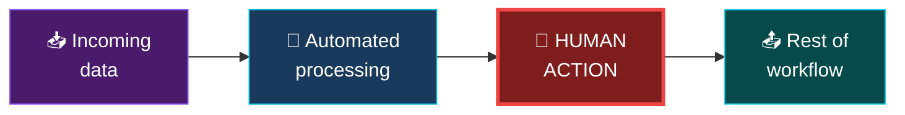
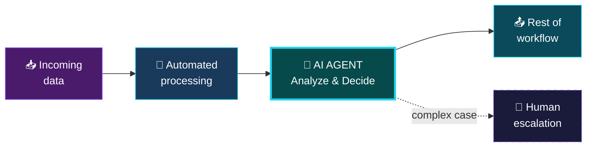
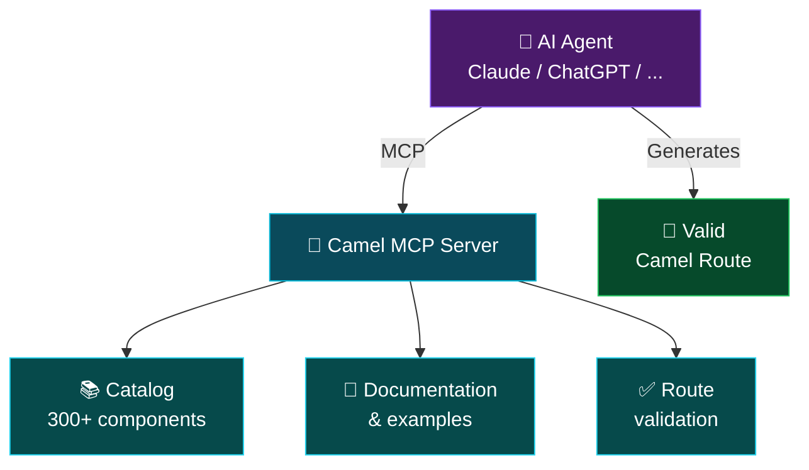
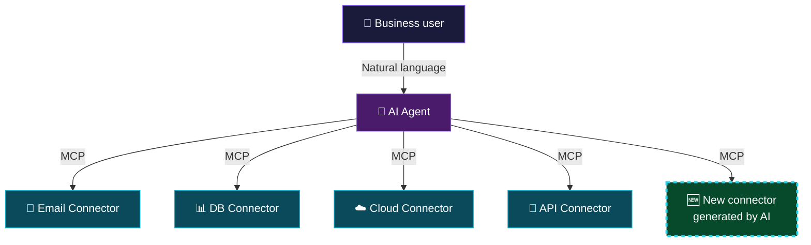
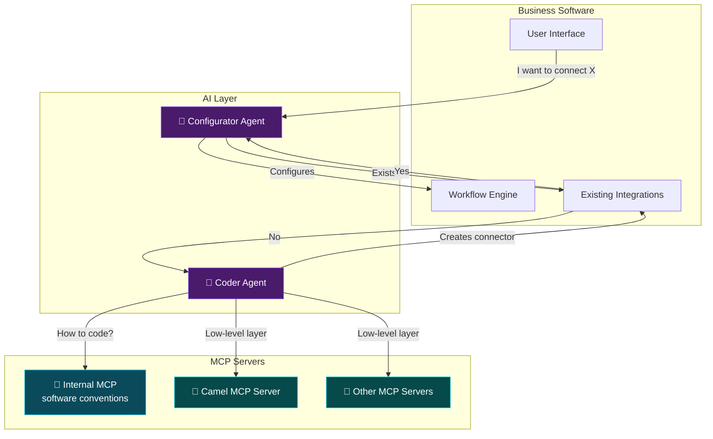

# Intelligent Integration

<div class="pt-6">
  <span class="text-2xl text-gray-300">When your data flows become autonomous</span>
</div>

<div class="pt-8">
  <span class="px-4 py-2 rounded-lg bg-gradient-to-r from-purple-500/30 to-cyan-500/30 border border-purple-400/50 text-lg">
    From classic integration to agentic integration
  </span>
</div>

<div class="abs-br m-6 flex gap-2">
  <span class="text-sm opacity-50">Zineb Bendhiba — 2026</span>
</div>

---
transition: fade-out
layout: two-cols
class: text-left
---

# Zineb Bendhiba

<div class="mt-6 space-y-3 opacity-80">

- Principal Software Engineer @ IBM / Red Hat
- Apache Camel PMC member
- Camel Quarkus maintainer
- Contributor: Quarkus, Kaoto, Wanaku, Camel AI

</div>

<div class="my-8 grid grid-cols-[40px_1fr] gap-y-4">
  <ri-github-line class="opacity-50"/>
  <div><a href="https://github.com/zbendhiba" target="_blank">zbendhiba</a></div>
  <ri-twitter-x-line class="opacity-50"/>
  <div><a href="https://x.com/ZinebBendhiba" target="_blank">@ZinebBendhiba</a></div>
  <ri-bluesky-line class="opacity-50"/>
  <div><a href="https://bsky.app/profile/zinebbendhiba.com" target="_blank">@zinebbendhiba.com</a></div>
  <ri-global-line class="opacity-50"/>
  <div><a href="https://zinebbendhiba.com" target="_blank">zinebbendhiba.com</a></div>
</div>

::right::

<div class="flex items-center justify-center h-full">
  
</div>

---
layout: center
class: text-center
---

# Integration works.

<div class="text-xl mt-6 text-gray-400 max-w-2xl mx-auto">
  For 20 years, we've been connecting systems with proven patterns.
</div>

<div class="mt-10 grid grid-cols-4 gap-6 max-w-3xl mx-auto">
  <div class="p-4 rounded-xl bg-purple-500/10 border border-purple-500/30">
    <div class="text-3xl mb-2">📨</div>
    <div class="text-sm">Messaging</div>
  </div>
  <div class="p-4 rounded-xl bg-cyan-500/10 border border-cyan-500/30">
    <div class="text-3xl mb-2">🔄</div>
    <div class="text-sm">Transformation</div>
  </div>
  <div class="p-4 rounded-xl bg-purple-500/10 border border-purple-500/30">
    <div class="text-3xl mb-2">🛣️</div>
    <div class="text-sm">Routing</div>
  </div>
  <div class="p-4 rounded-xl bg-cyan-500/10 border border-cyan-500/30">
    <div class="text-3xl mb-2">🔗</div>
    <div class="text-sm">Connectors</div>
  </div>
</div>

<div class="mt-8 text-sm text-gray-500">
  Enterprise Integration Patterns — Apache Camel — ...
</div>

<!--
- Integration is not a problem to solve — it works
- The question is: how do we go further?
-->

---
layout: default
---

# A classic integration workflow

<div class="mt-6">


</div>

<div class="mt-8 text-center text-lg text-gray-400">
  Everything is automated, predictable, reliable.
</div>

<v-click>

<div class="mt-4 text-center text-xl text-amber-400">
  Until a human has to step in...
</div>

</v-click>

<!--
- [click] Until the human intervention — that's where it breaks
-->

---
layout: center
---

# The human bottleneck

<div class="mt-6">



</div>

<div class="grid grid-cols-2 gap-6 mt-8 max-w-3xl mx-auto">

<div class="p-5 rounded-xl bg-red-500/10 border border-red-500/30">
  <div class="font-bold text-red-400 mb-2">The workflow is blocked</div>
  <div class="text-sm text-gray-400">Waiting for a human to analyze, validate, decide. Minutes, hours, sometimes days.</div>
</div>

<div class="p-5 rounded-xl bg-red-500/10 border border-red-500/30">
  <div class="font-bold text-red-400 mb-2">The human does repetitive work</div>
  <div class="text-sm text-gray-400">Analyzing logs, reading PDFs, classifying content... tasks that AI can already do.</div>
</div>

</div>

<!--
- The red block is the human breaking the automated flow
-->

---
layout: center
class: text-center
---

# Which human tasks are blocking your workflows?

<div class="grid grid-cols-3 gap-5 mt-8 max-w-3xl mx-auto text-left">

<v-clicks>

<div class="p-5 rounded-xl bg-purple-500/10 border border-purple-500/30">
  <div class="text-2xl mb-2">📋</div>
  <div class="font-bold text-purple-300">Form validation</div>
  <div class="text-sm text-gray-400 mt-2">Read a PDF, check the fields, cross-reference with a database</div>
</div>

<div class="p-5 rounded-xl bg-cyan-500/10 border border-cyan-500/30">
  <div class="text-2xl mb-2">🔍</div>
  <div class="font-bold text-cyan-300">Log analysis</div>
  <div class="text-sm text-gray-400 mt-2">Detect anomalies, classify errors, decide on the action</div>
</div>

<div class="p-5 rounded-xl bg-emerald-500/10 border border-emerald-500/30">
  <div class="text-2xl mb-2">📄</div>
  <div class="font-bold text-emerald-300">Content classification</div>
  <div class="text-sm text-gray-400 mt-2">Sort emails, categorize tickets, route by topic</div>
</div>

<div class="p-5 rounded-xl bg-amber-500/10 border border-amber-500/30">
  <div class="text-2xl mb-2">✅</div>
  <div class="font-bold text-amber-300">Data approval</div>
  <div class="text-sm text-gray-400 mt-2">Check consistency, validate compliance, give the green light</div>
</div>

<div class="p-5 rounded-xl bg-rose-500/10 border border-rose-500/30">
  <div class="text-2xl mb-2">🧾</div>
  <div class="font-bold text-rose-300">Information extraction</div>
  <div class="text-sm text-gray-400 mt-2">Read invoices, extract amounts, structure free-form data</div>
</div>

<div class="p-5 rounded-xl bg-indigo-500/10 border border-indigo-500/30">
  <div class="text-2xl mb-2">💬</div>
  <div class="font-bold text-indigo-300">Sentiment analysis</div>
  <div class="text-sm text-gray-400 mt-2">Assess the tone of a customer message, prioritize urgencies</div>
</div>

</v-clicks>

</div>

<!--
- All these tasks are cognitive but repetitive = AI's sweet spot
-->

---
layout: center
---

# Use case 1: Unblocking workflows with AI

<div class="text-lg text-gray-400 text-center mb-6">
  Replace the human bottleneck with an AI agent in the flow
</div>

<div class="mt-4">



</div>

<div class="grid grid-cols-3 gap-4 mt-8 max-w-3xl mx-auto text-center text-sm">
  <div class="p-3 rounded-lg bg-emerald-500/10 border border-emerald-500/30 text-emerald-300">
    Processing time: minutes → seconds
  </div>
  <div class="p-3 rounded-lg bg-emerald-500/10 border border-emerald-500/30 text-emerald-300">
    Available 24/7
  </div>
  <div class="p-3 rounded-lg bg-emerald-500/10 border border-emerald-500/30 text-emerald-300">
    Human escalation when needed
  </div>
</div>

<!--
- AI handles the routine, humans handle the exceptions
-->

---
layout: two-cols
layoutClass: gap-8
---

# Concrete example

**Invoice PDF validation**

<div class="mt-4 text-sm space-y-3">

<v-clicks>

<div class="p-3 rounded-lg bg-red-500/10 border border-red-500/20">
  <span class="text-red-400 font-bold">Before:</span> An employee opens each PDF, checks amounts, compares with the purchase order, approves or rejects. <span class="text-red-400">~15 min/invoice</span>
</div>

<div class="p-3 rounded-lg bg-emerald-500/10 border border-emerald-500/20">
  <span class="text-emerald-400 font-bold">After:</span> An AI agent in the workflow reads the PDF, extracts data, cross-references with the database, and decides. Humans only intervene on edge cases. <span class="text-emerald-400">~5 sec/invoice</span>
</div>

</v-clicks>

</div>

<v-click>

<div class="mt-6 p-3 rounded-lg bg-purple-500/10 border border-purple-500/30 text-sm">
  AI doesn't replace humans. <br>It <span class="text-purple-300 font-bold">frees humans</span> for the decisions that truly matter.
</div>

</v-click>

::right::

<div class="mt-12">

```yaml
# Camel route + OpenAI structured output
- route:
    from:
      uri: file:invoices/incoming
      steps:
        - setBody:
            simple: "Analyze this invoice.
              Check amount, VAT,
              purchase order match."
        - to:
            uri: openai:chat-completion
            parameters:
              jsonSchema: >
                resource:classpath:
                invoice-decision.schema.json
        - setVariable:
            name: decision
            jsonpath:
              expression: $.approved
        - choice:
            when:
              - simple: "${variable.decision}"
                steps:
                  - to: sql:insert-approved
            otherwise:
              steps:
                - to: slack:finance-review
```

</div>

<!--
- Right side: Camel example with OpenAI structured output (jsonSchema)
- The model returns structured JSON with the "approved" field
- No free-text parsing — reliable decision
-->

---
layout: center
class: text-center
---

# AI can reason within your workflows.

<div class="mt-6 text-xl text-gray-400 max-w-2xl mx-auto">
  But can it also <span class="text-purple-400 font-bold">create</span> them?
</div>

<!--
- Transition: we've seen reasoning → now creating
-->

---
layout: center
---

# Create: AI as an integration developer

<div class="text-lg text-gray-400 text-center mb-8">
  What if an AI agent could design your integration workflows?
</div>

<div class="grid grid-cols-3 gap-6 max-w-3xl mx-auto text-center">

<v-clicks>

<div class="p-5 rounded-2xl bg-purple-500/10 border border-purple-500/30">
  <div class="text-3xl mb-3">💬</div>
  <div class="font-bold text-purple-300 mb-2">Describe</div>
  <div class="text-sm text-gray-400">The user expresses their need in natural language</div>
</div>

<div class="p-5 rounded-2xl bg-cyan-500/10 border border-cyan-500/30">
  <div class="text-3xl mb-3">🔍</div>
  <div class="font-bold text-cyan-300 mb-2">Search</div>
  <div class="text-sm text-gray-400">The agent explores the component catalog and finds the right combination</div>
</div>

<div class="p-5 rounded-2xl bg-emerald-500/10 border border-emerald-500/30">
  <div class="text-3xl mb-3">⚡</div>
  <div class="font-bold text-emerald-300 mb-2">Generate</div>
  <div class="text-sm text-gray-400">The agent produces the integration workflow, ready to run</div>
</div>

</v-clicks>

</div>

<!--
- Describe → Search → Generate: 3 steps, no code to write
-->

---
layout: two-cols
layoutClass: gap-8
---

# Example: the Camel MCP Server

<div class="mt-4 space-y-2 text-sm">

<v-clicks>

<div class="p-2 rounded-lg bg-purple-500/10 border border-purple-500/20">
  The agent queries the catalog: <span class="text-purple-300">"Which components can read emails?"</span>
</div>

<div class="p-2 rounded-lg bg-cyan-500/10 border border-cyan-500/20">
  Returns components, options, and examples
</div>

<div class="p-2 rounded-lg bg-emerald-500/10 border border-emerald-500/20">
  Generates a valid Camel route
</div>

<div class="p-2 rounded-lg bg-purple-500/10 border border-purple-500/20">
  <span class="text-purple-300">Validates the routes</span> before execution
</div>

<div class="p-2 rounded-lg bg-amber-500/10 border border-amber-500/20 text-xs">
  Compatible: Claude Code, OpenAI Codex, GitHub Copilot, JetBrains AI, or any MCP client
</div>

</v-clicks>

</div>

::right::

<div class="mt-12">



</div>

<!--
- MCP Server exposes the Apache Camel catalog (300+ components)
- [click] Queries the catalog in natural language
- [click] Returns components, options, examples
- [click] Generates a valid route
- [click] Validates the route before execution — no blind trust
- [click] Compatible with Claude Code, Codex, Copilot, JetBrains AI, any MCP client
-->

---
layout: center
class: text-center
---

# We can go even further.

<div class="mt-6 text-xl text-gray-400 max-w-2xl mx-auto">
  AI creates workflows for <span class="text-cyan-400">developers</span>.<br><br>
  What if it could also make <span class="text-purple-400 font-bold">business software</span> extensible by its users?
</div>

<!--
- Transition: creating for devs → extending for business users
-->

---
layout: default
---

# Business software hides integration

<div class="mt-6 grid grid-cols-2 gap-8">

<div>
  <div class="text-lg text-purple-300 mb-4">What the user sees:</div>
  <div class="p-6 rounded-xl bg-purple-500/10 border border-purple-500/30">
    <div class="space-y-3 text-sm">
      <div class="p-2 rounded bg-purple-500/10">📝 Request form</div>
      <div class="text-center text-purple-400">↓</div>
      <div class="p-2 rounded bg-purple-500/10">✅ Manager approval</div>
      <div class="text-center text-purple-400">↓</div>
      <div class="p-2 rounded bg-purple-500/10">📧 Email notification</div>
      <div class="text-center text-purple-400">↓</div>
      <div class="p-2 rounded bg-purple-500/10">📊 Dashboard update</div>
    </div>
  </div>
</div>

<div>
  <div class="text-lg text-cyan-300 mb-4">What's actually running:</div>
  <div class="p-6 rounded-xl bg-cyan-500/10 border border-cyan-500/30">
    <div class="space-y-3 text-sm">
      <div class="p-2 rounded bg-cyan-500/10">📥 HTTP endpoint + validation</div>
      <div class="text-center text-cyan-400">↓</div>
      <div class="p-2 rounded bg-cyan-500/10">🔄 Workflow engine + routing</div>
      <div class="text-center text-cyan-400">↓</div>
      <div class="p-2 rounded bg-cyan-500/10">📨 SMTP connector</div>
      <div class="text-center text-cyan-400">↓</div>
      <div class="p-2 rounded bg-cyan-500/10">🔗 REST API call + DB write</div>
    </div>
  </div>
</div>

</div>

<v-click>

<div class="mt-6 text-center text-amber-400">
  The problem? These workflows are frozen. Adding an integration = custom development.
</div>

</v-click>

<!--
- [click] Frozen workflows = the real problem
-->

---
layout: center
---

# Use case 2: Making workflows AI-configurable

<div class="text-gray-400 text-center mb-8">
  AI agents that configure and extend workflows automatically
</div>

<div class="grid grid-cols-2 gap-8 max-w-3xl mx-auto">

<div class="p-6 rounded-2xl bg-gradient-to-b from-purple-500/20 to-transparent border border-purple-500/30">
  <div class="text-3xl mb-3">🛠️</div>
  <div class="text-lg font-bold text-purple-300 mb-3">Configurator Agent</div>
  <div class="text-sm text-gray-400 space-y-2">
    <div>The user describes their need in natural language</div>
    <div class="text-purple-300">"When a customer signs up, send a welcome email and create a Jira ticket"</div>
    <div>The agent generates and configures the integration workflow</div>
  </div>
</div>

<div class="p-6 rounded-2xl bg-gradient-to-b from-cyan-500/20 to-transparent border border-cyan-500/30">
  <div class="text-3xl mb-3">🧠</div>
  <div class="text-lg font-bold text-cyan-300 mb-3">Developer Agent</div>
  <div class="text-sm text-gray-400 space-y-2">
    <div>The requested integration doesn't exist yet?</div>
    <div class="text-cyan-300">The agent develops the connector, tests it, and adds it to the software</div>
    <div>Autonomous creation of new integrations</div>
  </div>
</div>

</div>

<!--
- Two levels of autonomy within the same software
-->

---
layout: two-cols
layoutClass: gap-8
---

# From "dev only" to "user empowered"

<div class="mt-4">

### The classic path

<div class="mt-4 space-y-2 text-sm">
  <div class="p-2 rounded bg-red-500/10 text-red-300">1. User requests a Salesforce integration</div>
  <div class="p-2 rounded bg-red-500/10 text-red-300">2. Ticket created → dev backlog</div>
  <div class="p-2 rounded bg-red-500/10 text-red-300">3. A developer codes the connector</div>
  <div class="p-2 rounded bg-red-500/10 text-red-300">4. Tests, review, deployment</div>
  <div class="p-2 rounded bg-red-500/10 text-red-300">5. 3 weeks later... ✅</div>
</div>

</div>

::right::

<div class="mt-4">

### The AI + MCP path

<div class="mt-4 space-y-2 text-sm">

<v-clicks>

  <div class="p-2 rounded bg-emerald-500/10 text-emerald-300">1. User describes their need</div>
  <div class="p-2 rounded bg-emerald-500/10 text-emerald-300">2. AI agent identifies the required connector</div>
  <div class="p-2 rounded bg-emerald-500/10 text-emerald-300">3. Via MCP, it configures the integration</div>
  <div class="p-2 rounded bg-emerald-500/10 text-emerald-300">4. User validates and activates</div>
  <div class="p-2 rounded bg-emerald-500/10 text-emerald-300">5. A few minutes later... ✅</div>

</v-clicks>

</div>

</div>

<!--
- Left: classic = ticket, backlog, dev, 3 weeks
- [clicks] Right: AI + MCP = describe, identify, configure, validate, a few minutes
- Paradigm shift
-->

---
layout: center
---

# MCP: The bridge between AI agents and your systems

<div class="mt-6">



</div>

<div class="mt-6 text-center">
  <span class="px-4 py-2 rounded-lg bg-cyan-500/20 border border-cyan-500/40 text-cyan-300">
    MCP = Model Context Protocol — built for devs, useful for everyone
  </span>
</div>

<!--
- User speaks in natural language → AI agent → connectors via MCP
- Key point: dashed connector = new, generated by AI
- The software extends itself
-->

---
layout: center
---

# Autonomous integration in action



<!--
- Full diagram: user → Configurator Agent → exists? → configures the workflow
- If no → Coder Agent → internal MCP (conventions) + external MCP (Camel, others) for low-level
- The agent creates the missing connector
-->

---
layout: center
class: text-center
---

# The vision: integration at 3 levels of autonomy

<div class="grid grid-cols-3 gap-6 mt-8 max-w-3xl mx-auto">

<div class="p-6 rounded-2xl bg-gradient-to-b from-purple-500/20 to-transparent border border-purple-500/30 text-center">
  <div class="text-4xl mb-4">🔧</div>
  <div class="text-lg font-bold text-purple-300">Level 1</div>
  <div class="text-sm font-bold text-purple-200 mt-1 mb-3">Assisted</div>
  <div class="text-sm text-gray-400">
    AI helps the developer create routes and configure connectors
  </div>
</div>

<div class="p-6 rounded-2xl bg-gradient-to-b from-cyan-500/20 to-transparent border border-cyan-500/30 text-center">
  <div class="text-4xl mb-4">🤖</div>
  <div class="text-lg font-bold text-cyan-300">Level 2</div>
  <div class="text-sm font-bold text-cyan-200 mt-1 mb-3">Delegated</div>
  <div class="text-sm text-gray-400">
    AI agents replace human tasks in existing workflows
  </div>
</div>

<div class="p-6 rounded-2xl bg-gradient-to-b from-emerald-500/20 to-transparent border border-emerald-500/30 text-center">
  <div class="text-4xl mb-4">🧠</div>
  <div class="text-lg font-bold text-emerald-300">Level 3</div>
  <div class="text-sm font-bold text-emerald-200 mt-1 mb-3">Autonomous</div>
  <div class="text-sm text-gray-400">
    AI creates and extends integrations autonomously via MCP
  </div>
</div>

</div>

<!--
- Level 1 Assisted: AI helps the dev (Camel MCP Server, available today)
- Level 2 Delegated: AI replaces human tasks in existing workflows
- Level 3 Autonomous: AI creates and extends integrations via MCP
- We're moving from 1 to 2, level 3 is the direction
-->

---
layout: center
---

# Challenges ahead

<div class="grid grid-cols-2 gap-6 mt-8 max-w-3xl mx-auto">

<div class="p-5 rounded-xl bg-amber-500/10 border border-amber-500/30">
  <div class="font-bold text-amber-300 mb-2">🔒 Security & Governance</div>
  <div class="text-sm text-gray-400">Who authorizes the agent to connect to a system? Audit trail, permissions, data isolation.</div>
</div>

<div class="p-5 rounded-xl bg-amber-500/10 border border-amber-500/30">
  <div class="font-bold text-amber-300 mb-2">🎯 Generated code quality</div>
  <div class="text-sm text-gray-400">Imprecise prompts, incomplete MCP descriptions, outdated APIs. Validation, automated tests, and dry-runs are essential.</div>
</div>

<div class="p-5 rounded-xl bg-amber-500/10 border border-amber-500/30">
  <div class="font-bold text-amber-300 mb-2">🤝 Human in the loop</div>
  <div class="text-sm text-gray-400">Autonomy yes, but with oversight. Humans validate critical cases and new connectors.</div>
</div>

<div class="p-5 rounded-xl bg-amber-500/10 border border-amber-500/30">
  <div class="font-bold text-amber-300 mb-2">📏 Standardization</div>
  <div class="text-sm text-gray-400">MCP is young. Agentic integration patterns still need to be defined and stabilized.</div>
</div>

</div>

<!--
- Security: who authorizes the agent to connect to a prod system?
- Quality: imprecise prompts, incomplete MCP descriptions, outdated APIs → validation + dry-run
- Human in the loop: autonomy with oversight
- Standardization: MCP is still young, patterns to define
-->

---
layout: center
class: text-center
---

# What already exists today

<div class="mt-8 space-y-4 text-lg">

<v-clicks>

<div class="px-6 py-3 rounded-xl bg-purple-500/15 border border-purple-500/30 inline-block">
  Apache Camel + OpenAI / LangChain4j components = AI in your workflows
</div>

<div class="px-6 py-3 rounded-xl bg-purple-500/15 border border-purple-500/30 inline-block">
  Apache Camel as a bridge between your existing processes and external agents
</div>

<div class="px-6 py-3 rounded-xl bg-cyan-500/15 border border-cyan-500/30 inline-block">
  Camel MCP Server = AI creates and validates your integration routes
</div>

<div class="px-6 py-3 rounded-xl bg-emerald-500/15 border border-emerald-500/30 inline-block">
  Kaoto Editor to visualize and edit generated routes
</div>

<div class="px-6 py-3 rounded-xl bg-amber-500/15 border border-amber-500/30 inline-block">
  Everything is open source — ready to experiment
</div>

</v-clicks>

</div>

<!--
- Everything is available and open source — you can start experimenting now
-->

---
layout: center
class: text-center
---

# Thank you!

<div class="mt-8 text-xl text-gray-400 max-w-xl mx-auto">
  Integration is not dead.<br>
  It's becoming <span class="text-cyan-400 font-bold">intelligent</span> and <span class="text-purple-400 font-bold">autonomous</span>.
</div>

<div class="mt-12 grid grid-cols-2 gap-4 max-w-md mx-auto text-left text-sm">
  <div class="text-gray-500">X</div>
  <div><a href="https://x.com/ZinebBendhiba">@ZinebBendhiba</a></div>
  <div class="text-gray-500">Bluesky</div>
  <div><a href="https://bsky.app/profile/zinebbendhiba.com">@zinebbendhiba.com</a></div>
  <div class="text-gray-500">Web</div>
  <div><a href="https://zinebbendhiba.com">zinebbendhiba.com</a></div>
</div>

<div class="mt-8 flex items-center justify-center gap-8">
  
  <span class="px-4 py-2 rounded-lg bg-purple-500/20 border border-purple-500/40 text-sm text-purple-300">
    Questions?
  </span>
</div>
