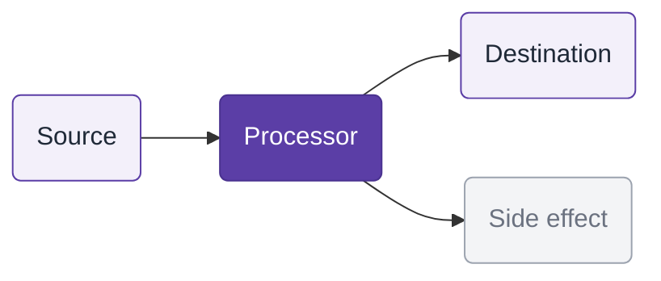

# TALK_TITLE

<div class="mt-4 text-2xl" style="color: #5b3ea6;">
TALK_SUBTITLE
</div>

<div class="abs-br m-6">
  <span class="text-sm" style="color: #6b7280;">Zineb Bendhiba — TALK_DATE</span>
</div>

---
layout: default
---

<div class="grid grid-cols-[3fr_2fr] gap-8 items-center h-full">

<div>

# Zineb Bendhiba

<p style="color: #5b3ea6; font-weight: 600; text-transform: uppercase; letter-spacing: 0.12em; font-size: 0.8rem;">Principal Software Engineer @ IBM</p>

I build open source integration tools.

Apache Camel PMC member<br>
Camel Quarkus and Quarkus Qdrant maintainer<br>
Camel AI and Camel LangChain4j

<div class="mt-4 flex items-center gap-6">
  <div class="grid grid-cols-[24px_1fr] gap-y-3 gap-x-2 text-sm" style="color: #6b7280;">
    <ri-github-line class="opacity-50"/><div><a href="https://github.com/zbendhiba" target="_blank">zbendhiba</a></div>
    <ri-twitter-x-line class="opacity-50"/><div><a href="https://x.com/ZinebBendhiba" target="_blank">@ZinebBendhiba</a></div>
    <ri-bluesky-line class="opacity-50"/><div><a href="https://bsky.app/profile/zinebbendhiba.com" target="_blank">@zinebbendhiba.com</a></div>
    <ri-linkedin-line class="opacity-50"/><div><a href="https://www.linkedin.com/in/zbendhiba" target="_blank">zbendhiba</a></div>
    <ri-instagram-line class="opacity-50"/><div><a href="https://www.instagram.com/zineb.bendhiba" target="_blank">zineb.bendhiba</a></div>
    <ri-global-line class="opacity-50"/><div><a href="https://zinebbendhiba.com" target="_blank">zinebbendhiba.com</a></div>
  </div>
  <div style="width: 2px; background: #5b3ea6; align-self: stretch; opacity: 0.3;"></div>
  <div class="flex items-center gap-5 opacity-60">
    
    
    
    
  </div>
</div>

</div>

<div class="flex flex-col items-center justify-center gap-6">
  
</div>

</div>

---
layout: center
class: zb-divider
---

# Section title

---
layout: default
---

# Slide title

<span class="zb-muted">Subtitle or context line</span>

Content goes here.

---
layout: default
---

# Architecture overview

<span class="zb-muted">Example mermaid diagram</span>

<div class="mt-6">



</div>

<div class="mt-6 zb-aside text-sm">
Key takeaway goes here. Use <strong>bold</strong> for emphasis.
</div>

<!--
- Speaker notes for the mermaid slide
- Explain the diagram flow
-->

---
layout: two-cols
layoutClass: gap-8
---

# Code example

<span class="zb-muted">Example code block with terminal style</span>

<div class="mt-6">

```yaml
- route:
    from:
      uri: direct:start
      steps:
        - log:
            message: "Hello ${body}"
        - to:
            uri: mock:result
```

</div>

::right::

<div class="mt-16">

<div class="zb-aside text-sm">
The terminal-style code block is the visual signature. Dark background, colored dots, rounded corners.
</div>

<div class="mt-8 space-y-3 text-sm">

**Left side**: the code.

**Right side**: the explanation.

</div>

</div>

<!--
- Speaker notes for the code slide
- Two-column layout: code left, explanation right
-->

---
layout: center
class: zb-divider
---

# Thank you

<div class="mt-8 text-xl" style="color: rgba(255,255,255,0.8);">
  Questions?
</div>

<div class="mt-12 text-sm" style="color: rgba(255,255,255,0.6);">
  Zineb Bendhiba — TALK_DATE
</div>
